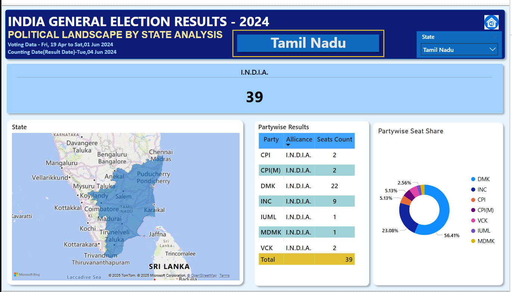
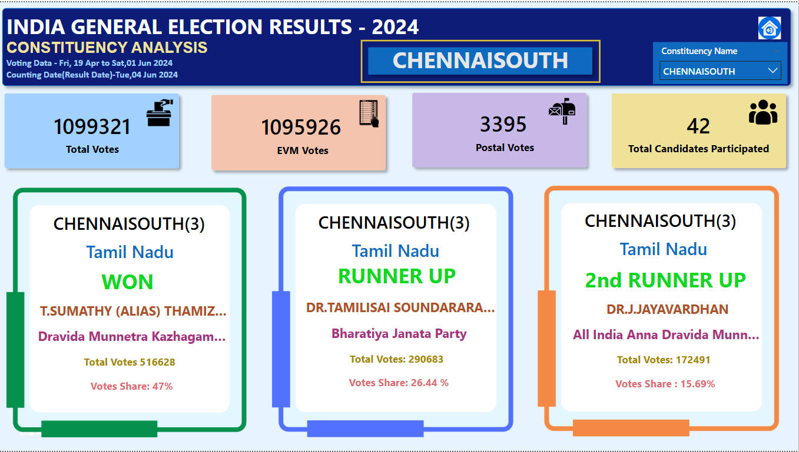

# Indian General Election Results Analysis 2024 Power BI
# 🇮🇳 India General Election Results – 2024

This project provides a suite of interactive dashboards designed to analyze the results of the 2024 Indian General Elections. It offers insights at the national, state, and constituency levels, aiding political analysts, researchers, and the general public in understanding the electoral landscape.

---

## 📊 Dashboard 1: Summary Insights

A high-level overview of seat distribution among major political alliances and independent candidates.

### Key Metrics:
- **NDA Alliance:**
  - Total seats won
  - Percentage of overall seats
  - Detailed matrix table via bookmark

- **I.N.D.I.A. Alliance:**
  - Total seats won
  - Seat share percentage
  - Grid view of all wins

- **Independents & Others:**
  - Number and percentage of seats won
  - Bookmark table of results

### Party-Level Analysis:
- List of NDA/I.N.D.I.A. parties with logos and seat counts.

---

## 🗺️ Dashboard 2: Statewise Electoral Analysis

In-depth view of results distributed across Indian states and union territories.

### Visual Features:
- **State Summary:**
  - Total seats
  - Majority alliance
  - NDA & I.N.D.I.A. seat counts
  - Interactive state map with tooltips

- **Constituency Breakdown:**
  - Bubble map representing each seat
  - Winner, party, vote count, margin
  - Color-coded by alliance

- **Leading State by Seats:**
  - Highlights state where NDA/I.N.D.I.A. won the most
  - Drill-through to state-level data

---

## 🧭 Dashboard 3: Political Landscape by State

Breaks down results within a selected state for comparative party performance analysis.

### Features:
- **Dynamic State Selector**
- **Metrics:**
  - Seats won by NDA, I.N.D.I.A., and Others
- **Visuals:**
  - State map (constituency distribution)
  - Party-wise grid with alliance info
  - Donut chart of party seat share

---

## 🗳️ Dashboard 4: Constituency-Level Deep Dive

Offers a closer look at individual constituency results and voter behavior.

### Primary Metrics:
- Total votes cast
- Votes by EVM and postal ballot
- Number of candidates

### Candidate Performance:
- Winner, runner-up, and second runner-up
- Vote counts and percentages

---

## 📋 Dashboard 5: Details Grid View

Comprehensive table of election results for data analysis and export.

### Data Columns:
- Constituency, Candidates, Party, Alliance
- EVM Votes, Postal Votes, Total Votes
- Victory Margin

### Functionalities:
- Drill-through from other dashboards
- Excel export
- Bookmark-enabled reset view

---

## 🏠 Dashboard 6: Navigation Landing Page

Main entry point for the dashboard suite, optimized for usability and responsiveness.

### Features:
- Navigation cards for:
  - Overview
  - State Demographics
  - Political Landscape
  - Constituency Analysis
- Home button on all dashboards
- Interactive UI with icons and color cues
- Responsive design for various screen sizes

---

## 📂 Project Scope

This dashboard suite provides multi-level insights and is built for:
- Political commentary
- Public education
- Policy analysis
- Academic research

---

## 📦 Technologies Used

- Power BI
- DAX
- SQL (Data pre-processing)

---

## 📥 Data Source

Election results data obtained from:
- Election Commission of India
- Data Tutorials

---
## Images

Landing Page

Overview Analysis Page

State Demographics Page

Political Landscape By State Page

Constituency Analysis

Details Grid

